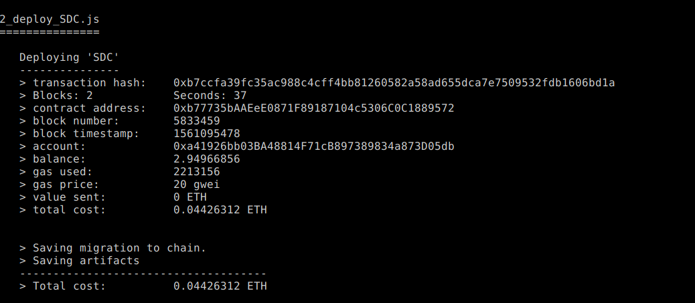

# SDC Contract

## Requirement
- MetaMask
- Truffle
- Solidity ^0.5.0
- Deployed on Ropsten

## Development
- `yarn`
- Copy `private.example.js` to `private.js` and edit the mnemonic key and Ropsten API Key.
- `truffle deploy --network ropsten`. Here is the information of the deployed contract
    
- To access the deployed contract, `truffle console --network ropsten`:
```
SDC.deployed().then((instance) => {
  instance.createSDC(..) // create a new contract

})`
```

## Reference
[Deployed Smart contracts with Truffle and Ropsten](https://medium.com/coinmonks/5-minute-guide-to-deploying-smart-contracts-with-truffle-and-ropsten-b3e30d5ee1e)
